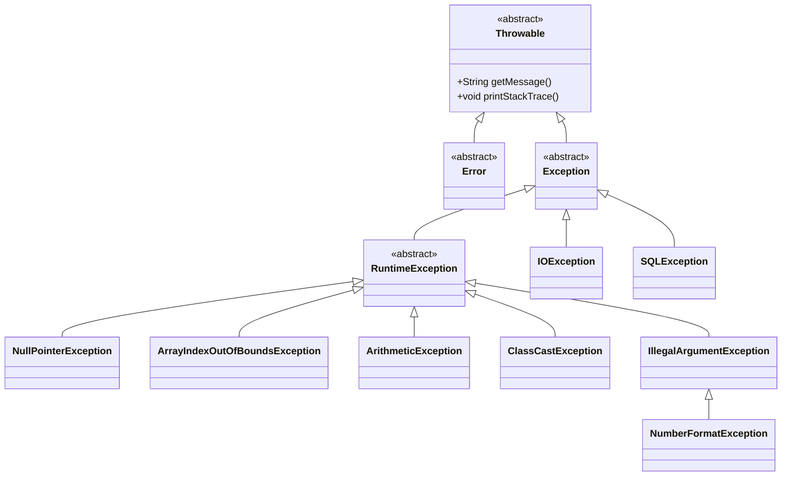
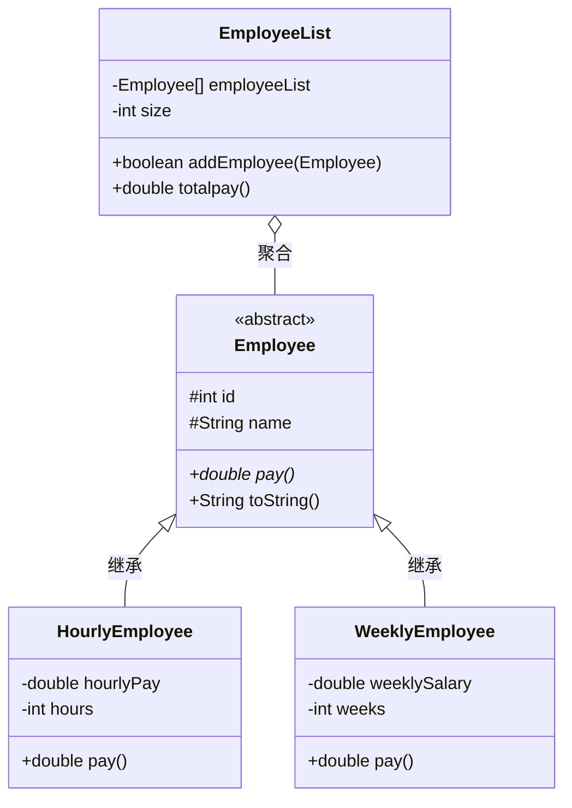

 一、语言基础
### 1.1 Java语言的历史
| 要点 | 内容 |
|------|------|
| **诞生时间** | 1995年由Sun Microsystems正式发布 |
| **创始人** | James Gosling（詹姆斯·高斯林） |
| **前身** | Oak语言（1991年），最初用于消费电子产品（机顶盒、微波炉等） |
| **命名由来** | 以Java咖啡（印尼爪哇岛咖啡）命名 |
| **设计理念** | "Write Once, Run Anywhere"（一次编写，到处运行） |
| **重要里程碑** | |
| | Java 1.0 (1996) — 首个正式版本 |
| | Java SE 5.0 (2004) — 引入泛型、注解、自动装箱、枚举 |
| | Java SE 8 (2014) — 引入Lambda表达式、Stream API、接口default/static方法 |
| | Java SE 11 (2018) — 首个长期支持版本（LTS） |
| | Java SE 17 (2021) — LTS版本 |
| | Java SE 21 (2023) — 最新LTS版本 |
| **所有权** | 2010年Oracle收购Sun Microsystems，Java归Oracle所有 |
| **语言特点** | 面向对象、跨平台、自动内存管理（GC）、健壮安全、多线程支持 |

### 1.2 Java程序的执行机制
#### 1.2.1 完整执行流程

	源代码(.java) → 编译器(javac) → 字节码(.class) → JVM → 机器码
      │                │              │              │
	   程序员编写        编译阶段        平台无关      运行阶段
	                                   中间代码      解释/JIT编译


#### 1.2.2 JVM（Java Virtual Machine）
| 方面 | 说明 |
|------|------|
| **定义** | 运行Java字节码的抽象计算机，是Java跨平台的核心 |
| **作用** | 将编译后的`.class`文件（字节码）解释或即时编译（JIT）为本地机器指令 |
| **核心组成** | 类加载器（ClassLoader）、运行时数据区（方法区/堆/栈等）、执行引擎（解释器+JIT编译器）、垃圾回收器（GC）、本地方法接口（JNI） |
#### 1.2.3 "一次编写，到处运行"的实现
- **编写一次**：写一份Java源代码
- **编译一次**：`javac`编译为`.class`字节码文件
- **到处运行**：任何操作系统只要有JVM，就能运行同一份字节码
#### 1.2.4 JDK vs JRE vs JVM
```text
JDK (Java Development Kit) — 开发工具包
├── JRE (Java Runtime Environment) — 运行环境
│   ├── JVM — 虚拟机
│   └── 核心类库
└── 开发工具（javac、java、javadoc、jar等）
```


| 缩写 | 全称 | 用途 | 包含 |
|------|------|------|------|
| **JDK** | Java Development Kit | 开发Java程序 | JRE + 编译器 + 开发工具 |
| **JRE** | Java Runtime Environment | 运行Java程序 | JVM + 核心类库 |
| **JVM** | Java Virtual Machine | 执行字节码 | 类加载器 + 执行引擎 + GC |
---
### 1.3 正确创建源文件
#### 1.3.1 源文件结构（必须按此顺序）
```java
// 1. package声明（可选，有则必须在第一行，注释除外）
package com.example.util;
// 2. import声明（可选，可以有多个，通配符*表示导入包下所有类）
import java.util.List;
import java.util.ArrayList;
import java.util.*;          // 通配符导入
// 3. 类/接口/枚举定义
public class MyClass {
    // 类体（成员变量、构造器、方法等）
}
// 可以有多个非public类
class HelperClass { }
class AnotherClass { }
```

#### 1.3.2 源文件关键规则

|规则|说明|
|---|---|
|**文件名**|必须与`public`类名完全相同（包括大小写），后缀`.java`|
|**一个public类**|一个`.java`文件最多只有一个`public`类|
|**多个非public类**|允许同一个文件中有多个非public类|
|**package位置**|在所有非注释代码之前，文件第一行|
|**import位置**|在package之后，类定义之前|
|**package语句**|最多一个，可没有（无package时属于默认包，不推荐）|

---

### 1.4 包声明与导入说明

#### 1.4.1 package声明
```
java

// 包声明必须在文件第一行（注释除外）
package com.example.myapp;  // 对应目录结构：com/example/myapp/
```
|规则|说明|
|---|---|
|一个源文件只能有一个`package`语句||
|必须位于文件第一行（注释除外）||
|包名全小写，用点`.`分隔层级||
|编译后的`.class`文件必须放在对应的目录结构中||
|没有package声明时，类属于"默认包"（不推荐用于正式项目）||

#### 1.4.2 import声明
```java
// 单类导入
import java.util.List;
// 通配符导入（导入包下所有类，不包含子包）
import java.util.*;
// 静态导入（导入静态成员）
import static java.lang.Math.PI;
import static java.lang.Math.*;
```

|规则|说明|
|---|---|
|位于package之后、类定义之前||
|可以有多个import语句||
|`import java.util.*;` 只导入`java.util`包下的类，不导入子包如`java.util.stream`||
|`java.lang`包自动导入，无需手动import||
|同一个包中的类不需要import||

---

### 1.5 类声明、接口声明和实现

#### 1.5.1 类的声明形式
```java

// 完整声明格式
[访问修饰符] [非访问修饰符] class 类名 [extends 父类] [implements 接口列表] {
    // 类体
}
// 示例
public class MyClass { }                          // 普通类
public final class FinalClass { }                 // 最终类（不能被继承）
public abstract class AbstractClass { }           // 抽象类
class DefaultClass { }                            // 包访问权限类
public class Child extends Parent implements A, B { } // 继承+实现多个接口
```

**类修饰符组合规则：**

|修饰符组合|允许？|说明|
|---|---|---|
|`public`|✅|公共类|
|`public final`|✅|不可继承的公共类|
|`public abstract`|✅|公共抽象类|
|`final abstract`|❌|矛盾！final不能继承，abstract必须被继承|
|默认（无修饰符）|✅|包访问权限（只能同包访问）|
|`private`（顶级类）|❌|顶级类只能是public或默认|
|`protected`（顶级类）|❌|同上，protected不能修饰顶级类|
|`static`（顶级类）|❌|只有内部类可以用static修饰|

#### 1.5.2 接口的声明

```java

// 完整声明格式
[访问修饰符] interface 接口名 [extends 父接口列表] {
    // 常量（自动 public static final）
    // 抽象方法（自动 public abstract）
    // default方法（Java 8+）
    // static方法（Java 8+）
}
// 示例
public interface Flyable {
    int MAX_SPEED = 100;           // public static final
    void fly();                     // public abstract
    default void land() { }         // default方法
    static void info() { }          // static方法
}
interface A extends B, C { }        // 接口多继承
```

#### 1.5.3 接口的实现

```java

// 类实现接口
class Bird implements Flyable {
    @Override
    public void fly() {             // 必须是public
        System.out.println("Bird flying");
    }
}
// 类实现多个接口
class SuperBird extends Animal implements Flyable, Swimmable, Runnable {
    // 继承Animal，同时实现三个接口
}
```
---

### 1.6 方法声明（包括主方法）

#### 1.6.1 方法声明的完整形式

```java

[访问修饰符] [非访问修饰符] 返回类型 方法名([参数类型 参数名, ...]) [throws 异常类型] {
    // 方法体
    [return 返回值;]
}
```

**完整示例：**
```java

public static final int calculate(int x, int y) throws ArithmeticException {
    return x / y;
}
```

#### 1.6.2 主方法（main方法）

```java

// 标准形式（必须严格遵守）
public static void main(String[] args) {
    // 程序入口
}
// 可变参数形式（合法但不常见）
public static void main(String... args) { }
```

|部分|要求|说明|
|---|---|---|
|`public`|✅ 必须|JVM需要从外部访问|
|`static`|✅ 必须|JVM无需创建对象即可调用|
|`void`|✅ 必须|主方法无返回值|
|方法名|`main`（全小写）|区分大小写|
|参数|`String[] args`|接收命令行参数|

> ⚠️ **常见错误**：
> 
> - `private static void main(...)` — 编译通过，但JVM找不到入口
>     
> - `public void main(...)` — 缺少static，不是程序入口
>     
> - `public static void Main(...)` — Main大写M，不是入口
>     
> - `public static int main(...)` — 返回int，不是入口
>     

---

### 1.7 变量声明和标识符

#### 1.7.1 变量声明

```java

// 基本类型变量
int count = 0;
double price = 9.99;
boolean flag = true;
char letter = 'A';
// 引用类型变量
String name = "Java";
Object obj = new Object();
int[] numbers = new int[10];
// 多变量声明
int a, b, c;                    // 三个int变量
int x = 1, y = 2, z = 3;       // 同时声明并初始化
```
#### 1.7.2 标识符命名规则

|规则|说明|合法示例|非法示例|
|---|---|---|---|
|组成字符|字母、数字、下划线`_`、美元符`$`|`name`, `_test`, `$var`|`na-me`, `a*b`|
|不能以数字开头|数字只能出现在中间或末尾|`a2z`, `var1`|`52pickup`, `2var`|
|不能是关键字/保留字|`class`, `int`, `new`, `goto`等|—|—|
|区分大小写|`Name`和`name`是两个不同的标识符|—|—|
|可含中文|语法允许但不推荐|`学生`, `姓名`|—|

#### 1.7.3 命名规范（行业标准）

|类型|规范|示例|说明|
|---|---|---|---|
|类名/接口名|**大驼峰**（PascalCase）|`MyClass`, `StudentDao`|每个单词首字母大写|
|方法名|**小驼峰**（camelCase）|`getName()`, `calculateArea()`|首单词小写，其余首字母大写|
|变量名|**小驼峰**|`studentCount`, `userName`|同方法名|
|常量名|**全大写+下划线**|`MAX_VALUE`, `DEFAULT_SIZE`|单词间用下划线分隔|
|包名|**全小写+点分隔**|`com.example.myapp`|层级用点分隔|

---

### 1.8 Java关键字

#### 1.8.1 关键字总表（按类别）

|类别|关键字|
|---|---|
|**访问控制**|`private`, `protected`, `public`|
|**类/接口/枚举**|`class`, `interface`, `enum`, `extends`, `implements`|
|**修饰符**|`abstract`, `final`, `static`, `synchronized`, `native`, `strictfp`, `transient`, `volatile`|
|**包相关**|`package`, `import`|
|**基本类型**|`byte`, `short`, `int`, `long`, `float`, `double`, `char`, `boolean`|
|**流程控制**|`if`, `else`, `switch`, `case`, `default`, `for`, `while`, `do`, `break`, `continue`, `return`|
|**异常处理**|`try`, `catch`, `finally`, `throw`, `throws`, `assert`|
|**对象相关**|`new`, `this`, `super`, `instanceof`|
|**其他**|`void`, `null`, `true`, `false`|
|**保留字**|`goto`, `const`（保留但未使用）|

> ⚠️ **注意**：`true`、`false`、`null`是字面量，不是关键字，但也不能作为标识符。`goto`和`const`是保留字。

---

### 1.9 变量初始化

#### 1.9.1 默认初始化值

|变量位置|是否有默认值|默认值|
|---|---|---|
|实例变量（成员变量）|✅ 有|见下表|
|静态变量（类变量）|✅ 有|见下表|
|局部变量（方法内）|❌ **无**|必须显式初始化才能使用|

#### 1.9.2 各类型默认值

|类型|默认值|
|---|---|
|`byte`|`0`|
|`short`|`0`|
|`int`|`0`|
|`long`|`0L`|
|`float`|`0.0f`|
|`double`|`0.0d`|
|`char`|`'\u0000'`（空字符，不是空格）|
|`boolean`|`false`|
|引用类型（类/接口/数组）|`null`|

```java

public class Demo {
    int instanceVar;               // 默认0
    static String staticVar;       // 默认null
    double price;                  // 默认0.0
    
    public void method() {
        int localVar;
        // System.out.println(localVar);  // ❌ 编译错误！局部变量未初始化
    }
}
```
#### 1.9.3 数组类型变量的初始化

```java

// 静态初始化
int[] arr1 = {1, 2, 3};
int[] arr2 = new int[]{1, 2, 3};
// 动态初始化（数组元素获得默认值）
int[] arr3 = new int[5];         // 5个元素，默认值均为0
String[] arr4 = new String[3];   // 3个元素，默认值均为null
boolean[] arr5 = new boolean[2]; // 2个元素，默认值均为false
// 多维数组
int[][] matrix = {{1,2}, {3,4}, {5,6}};
int[][] matrix2 = new int[3][4];   // 3行4列，所有元素默认0
int[][] jagged = new int[3][];     // 锯齿数组，每行需单独初始化
jagged[0] = new int[2];
jagged[1] = new int[5];
```
---

### 1.10 基本数据类型取值范围

#### 1.10.1 完整类型表

|类型|字节数|范围|默认值|包装类|
|---|---|---|---|---|
|`byte`|1|**-128 ~ 127**|`0`|Byte|
|`short`|2|**-32768 ~ 32767**|`0`|Short|
|`int`|4|**-2³¹ ~ 2³¹-1**（约±21亿）|`0`|Integer|
|`long`|8|**-2⁶³ ~ 2⁶³-1**|`0L`|Long|
|`float`|4|±1.4E-45 ~ ±3.4E+38|`0.0f`|Float|
|`double`|8|±4.9E-324 ~ ±1.8E+308|`0.0d`|Double|
|`char`|2|**0 ~ 65535**（无符号，Unicode）|`'\u0000'`|Character|
|`boolean`|JVM相关|`true` / `false`|`false`|Boolean|

> ⚠️ **高频考点**：
> 
> - `short`是有符号的（-32768~32767），`char`是无符号的（0~65535）
>     
> - `char`占2字节，使用UTF-16编码表示Unicode字符
>     

#### 1.10.2 常量表示形式

|类型|表示方式|示例|
|---|---|---|
|`int`|十进制|`42`|
||八进制（前缀`0`）|`052` = 十进制42|
||十六进制（前缀`0x`或`0X`）|`0x2A` = 十进制42|
||二进制（前缀`0b`或`0B`，Java 7+）|`0b101010` = 十进制42|
|`long`|后缀`L`或`l`|`42L`, `99999999999L`|
|`float`|后缀`F`或`f`|`3.14f`, `1.0F`|
|`double`|默认小数|`3.14`, `1.0`|
||科学计数法|`1.5e10`（= 1.5×10¹⁰）|
|||`1.5e-3`（= 0.0015）|
|`char`|单引号字符|`'A'`|
||Unicode转义|`'\u0041'`（= 'A'）|
||整数值|`65`（赋给char等同于'A'）|
|`boolean`|字面量|`true`, `false`|

#### 1.10.3 自动类型提升规则

```text

byte → short → int → long → float → double
                ↗
              char
```

```java

byte b = 10;
short s = b;     // ✅ byte → short 自动提升
int i = s;       // ✅ short → int
long l = i;      // ✅ int → long
float f = l;     // ✅ long → float
double d = f;    // ✅ float → double
char c = 'A';
int ic = c;      // ✅ char → int，值为65
// 运算时自动提升为int
short s1 = 10, s2 = 20;
// short s3 = s1 + s2;  // ❌ 编译错误！s1+s2结果是int
int s3 = s1 + s2;       // ✅
```
---

### 1.11 String、StringBuilder类型的基本使用

#### 1.11.1 三种字符串类对比

|特性|String|StringBuffer|StringBuilder|
|---|---|---|---|
|**可变性**|❌ 不可变|✅ 可变|✅ 可变|
|**线程安全**|✅ （不可变天然安全）|✅ （方法synchronized）|❌ 非线程安全|
|**性能（频繁拼接）**|低（产生大量中间对象）|中（同步开销）|高|
|**使用场景**|字符串内容不变|多线程环境拼接|单线程环境拼接|

#### 1.11.2 String关键特性

```java

// String不可变
String s1 = "Hello";
s1 = s1 + " World";        // ❌ 没有修改原对象！创建了新对象
// 原"Hello"对象未变，s1指向新的"Hello World"对象
// concat也不改变原字符串
String s2 = "Hello";
s2.concat(" World");       // 返回新字符串，但s2仍然指向"Hello"
System.out.println(s2);    // 输出 "Hello"
// 字符串常量池
String a = "Hello";
String b = "Hello";
String c = new String("Hello");
System.out.println(a == b);  // true — 指向常量池同一对象
System.out.println(a == c);  // false — c是堆中新建的对象
System.out.println(a.equals(c)); // true — equals比较内容
```
#### 1.11.3 StringBuilder常用方法

```java

StringBuilder sb = new StringBuilder();
StringBuilder sb2 = new StringBuilder("Hello");
StringBuilder sb3 = new StringBuilder(32);  // 初始容量
sb.append(" World");          // 追加
sb.append(true);              // 追加boolean
sb.insert(0, "Start: ");      // 插入
sb.replace(0, 5, "Hi");       // 替换
sb.delete(0, 3);              // 删除
sb.deleteCharAt(0);           // 删除指定位置字符
sb.reverse();                 // 反转
int len = sb.length();        // 长度
int cap = sb.capacity();      // 容量
char ch = sb.charAt(0);       // 获取字符
String result = sb.toString();// 转换为String
// ⚠️ append方法返回this（高频考点）
StringBuilder a = new StringBuilder("-");
StringBuilder b = a.append("-");
System.out.println(a == b);       // true — append返回调用者自身
System.out.println(a.length());   // 2 — "--"
```
---

## 二、运算符和函数

### 2.1 运算符优先级与结合性

#### 2.1.1 完整优先级表（由高到低）

|优先级|运算符|结合性|说明|
|---|---|---|---|
|1（最高）|`()` `[]` `.`|左|括号、数组下标、成员访问|
|2|`!` `~` `++` `--` `+`(正) `-`(负)|**右**|一元运算符|
|3|`*` `/` `%`|左|乘除取模|
|4|`+` `-`|左|加减|
|5|`<<` `>>` `>>>`|左|位移|
|6|`<` `<=` `>` `>=` `instanceof`|左|比较、类型检查|
|7|`==` `!=`|左|相等比较|
|8|`&`|左|按位与|
|9|`^`|左|按位异或|
|10|`\|`|左|按位或|
|11|`&&`|左|短路与|
|12|`\|`|左|短路或|
|13|`? :`|**右**|三元条件|
|14（最低）|`=` `+=` `-=` `*=` `/=` `%=` 等|**右**|赋值|

#### 2.1.2 结合性详解

**左结合（大多数运算符）：**

```java

int a = 10 - 5 - 2;     // (10 - 5) - 2 = 3（不是 10 - (5 - 2) = 7）
boolean b = 1 < 2 == true;  // (1 < 2) == true → true == true → true
```

**右结合（赋值、一元、三元）：**

```java

int a, b, c;
a = b = c = 10;         // a = (b = (c = 10)) — 从右向左
int x = 10;
int y = - -x;           // -(-x) — 从右向左
int z = a > b ? x : y > z ? m : n;  // a > b ? x : (y > z ? m : n)
```
#### 2.1.3 常见计算题

```java

// 自增自减
int a = 10;
int b = ++a + a++ + a;
// ++a: a变为11，值为11
// a++: 值为11，a变为12
// a: 值为12
// b = 11 + 11 + 12 = 34
// 取模结果符号 = 被除数符号
System.out.println(20 % -6);   // 2
System.out.println(-20 % 6);   // -2
// 整数除法截断
System.out.println(5 / 2);     // 2
// 短路与、短路或
boolean flag = true || false && false;
// && 优先级高于 ||
// 等价: true || (false && false) = true
```
---

### 2.2 函数参数传递

#### 2.2.1 核心原则

**Java中只有值传递！** — 方法调用时，实参的**值**被复制一份传给形参。

#### 2.2.2 基本类型参数

```java

void swap(int a, int b) {
    int temp = a;
    a = b;
    b = temp;
}
int x = 10, y = 20;
swap(x, y);
System.out.println(x + " " + y);  // 10 20 — 没有交换！只交换了副本
```
#### 2.2.3 引用类型参数
```java

// 通过副本引用可以修改对象内容
void modify(StringBuilder sb) {
    sb.append(" World");  // 修改了原对象
}
StringBuilder s = new StringBuilder("Hello");
modify(s);
System.out.println(s);  // "Hello World" — 原对象被修改
// 但交换引用本身无效
void swapRef(StringBuilder a, StringBuilder b) {
    StringBuilder temp = a;
    a = b;
    b = temp;  // 只交换了形参的引用副本，不影响实参
}
```
> ⚠️ **核心理解**：引用类型传递的是**引用的副本**。通过副本可以修改所指对象的内容，但不能改变原引用变量指向的地址。

---

## 三、流控制和异常处理

### 3.1 使用if和switch编写分支代码

#### 3.1.1 if-else

```java

if (condition) {
    // ...
} else if (anotherCondition) {
    // ...
} else {
    // ...
}
// ⚠️ 条件必须是boolean类型（与C/C++不同）
int x = 10;
// if (x) { }          // ❌ 编译错误
if (x > 0) { }         // ✅
// else与最近的if配对
if (true)
    if (false)
        System.out.println("a");
else                    // 与内层if(false)配对
    System.out.println("b");  // 输出 "b"
```

#### 3.1.2 switch语句

**传统switch（case穿透）：**

```java

int day = 3;
switch (day) {
    case 1:
        System.out.println("周一");
        break;               // 必须有break，否则穿透
    case 2:
    case 3:
    case 4:                  // 多个case共享代码
        System.out.println("工作日");
        break;
    default:
        System.out.println("未知");
}
```
**箭头语法（Java 14+，不穿透）：**

```java

switch (day) {
    case 1 -> System.out.println("周一");
    case 2, 3, 4 -> System.out.println("工作日");  // 多值匹配
    default -> System.out.println("未知");
}
```
> ⚠️ **注意**：箭头语法中，每个分支独立，不会穿透。

---

### 3.2 循环语句与标签化break/continue

#### 3.2.1 循环形式

```java

// while — 先判断后执行
while (condition) { }
// do-while — 先执行后判断（至少执行一次）
do { } while (condition);
// for — 传统形式
for (int i = 0; i < 10; i++) { }
// for-each — 增强for循环
for (int num : numbers) { }
```
#### 3.2.2 循环中的自增/自减陷阱

```java

// x++ < 3：先比较再自增
int x = 0;
while (x++ < 3) { }
// x=0: 0<3成立→x变1  进入循环
// x=1: 1<3成立→x变2  进入循环
// x=2: 2<3成立→x变3  进入循环
// x=3: 3<3不成立→x变4  退出
// ++x < 3：先自增再比较
int y = 0;
while (++y < 3) { }
// y先变1: 1<3成立→进入循环
// y变2: 2<3成立→进入循环
// y变3: 3<3不成立→退出
```

#### 3.2.3 标签化break和continue

```java

outer:                          // 标签
for (int i = 1; i <= 3; i++) {
    inner:                      // 内层标签
    for (int j = 1; j <= 3; j++) {
        if (i == 2 && j == 2) {
            break outer;        // 跳出外层循环，整个嵌套结束
        }
        System.out.println("i=" + i + ", j=" + j);
    }
}
outer:
for (int i = 1; i <= 3; i++) {
    for (int j = 1; j <= 3; j++) {
        if (j == 2) {
            continue outer;     // 跳过外层本次剩余，进入外层下一次迭代
        }
        System.out.println("i=" + i + ", j=" + j);
    }
}
```

|语句|作用|
|---|---|
|`break;`|跳出当前层循环|
|`break 标签;`|跳出标签指定的循环层|
|`continue;`|结束当前迭代，进入本层下一次迭代|
|`continue 标签;`|结束内层当前迭代，跳到标签层下一次迭代|

---

### 3.3 异常处理（try-catch-finally）

#### 3.3.1 基本语法

```java

try {
    // 可能抛出异常的代码
    int result = 10 / 0;
} catch (ArithmeticException e) {
    // 处理算术异常
    System.out.println("算术异常：" + e.getMessage());
} catch (Exception e) {
    // 处理其他异常（注意：父类catch放后面）
    System.out.println("其他异常");
} finally {
    // 无论是否异常都执行（通常用于资源清理）
    System.out.println("finally块执行");
}
```
**核心规则：**

|规则|说明|
|---|---|
|`try`后至少有一个`catch`或`finally`|`try-catch`、`try-finally`、`try-catch-finally` 均合法|
|`catch`可有0个或多个|多个catch时，子类异常在前，父类在后|
|`finally`最多一个|总是执行，即使try中有return|
|不能只有`try`|编译错误|

```java

// ✅ 合法：try-finally（无catch）
try {
    // code
} finally {
    // cleanup
}
// ❌ 非法：try单独存在
// try { }   // 编译错误
```

#### 3.3.2 try-with-resources（Java 7+自动关闭资源）

java

try (FileReader fr = new FileReader("file.txt");
     BufferedReader br = new BufferedReader(fr)) {
    String line = br.readLine();
} catch (IOException e) {
    e.printStackTrace();
}
// 资源自动关闭，无需finally

---

### 3.4 抛出异常的方法声明（throws和throw）

|关键字|位置|作用|示例|
|---|---|---|---|
|`throws`|方法签名中|**声明**该方法可能抛出哪些异常|`public void read() throws IOException { }`|
|`throw`|方法体内|**实际**抛出一个异常对象|`throw new IOException("错误");`|

```java

// throws：声明可能抛出的异常
public void checkAge(int age) throws Exception {
    if (age < 0) {
        throw new IllegalArgumentException("年龄不能为负数");  // throw：实际抛出
    }
}
```
---

### 3.5 Java异常类型的组织结构

```text

Throwable
├── Error（严重错误，程序不应处理）
│   ├── VirtualMachineError
│   │   ├── OutOfMemoryError        — 内存溢出
│   │   └── StackOverflowError      — 栈溢出
│   ├── AssertionError              — 断言错误
│   └── LinkageError                — 链接错误
│
└── Exception（异常，可处理）
    ├── RuntimeException（运行时异常 = 非受检异常）
    │   ├── NullPointerException          — 空指针
    │   ├── ArrayIndexOutOfBoundsException— 数组越界
    │   ├── ArithmeticException           — 算术异常（除零）
    │   ├── ClassCastException            — 类型转换异常
    │   ├── IllegalArgumentException      — 非法参数
    │   └── NumberFormatException         — 数字格式异常
    │
    └── 其他Exception（受检异常 Checked Exception）
        ├── IOException
        │   ├── FileNotFoundException
        │   └── EOFException
        ├── SQLException
        ├── ClassNotFoundException
        └── InterruptedException
```


**分类对比：**

|类型|检查时机|是否必须处理|示例|
|---|---|---|---|
|**Checked Exception**|编译时|✅ 必须处理（try-catch 或 throws声明）|IOException|
|**Unchecked Exception**|运行时|❌ 不强制处理|NullPointerException|
|**Error**|运行时|❌ 不应处理（通常无法恢复）|OutOfMemoryError|

---

### 3.6 自定义异常类

```java

// 1. 自定义受检异常（继承Exception）
public class MyCheckedException extends Exception {
    public MyCheckedException() {
        super();
    }
    
    public MyCheckedException(String message) {
        super(message);
    }
    
    public MyCheckedException(String message, Throwable cause) {
        super(message, cause);
    }
}
// 2. 自定义非受检异常（继承RuntimeException）
public class MyUncheckedException extends RuntimeException {
    public MyUncheckedException(String message) {
        super(message);
    }
}
// 3. 使用
public void validate(int value) throws MyCheckedException {
    if (value < 0) {
        throw new MyCheckedException("值不能为负：" + value);
    }
}
```
---

## 四、类类型

### 4.1 修饰符的使用

#### 4.1.1 类修饰符

|修饰符|含义|对顶级类|对内部类|
|---|---|---|---|
|`public`|所有地方可访问|✅|✅|
|默认（无修饰符）|同包可访问|✅|✅|
|`abstract`|抽象类，不能实例化|✅|✅|
|`final`|最终类，不能被继承|✅|✅|
|`private`|仅外部类可访问|❌|✅|
|`protected`|同包+子类|❌|✅|
|`static`|静态内部类|❌|✅|

**合法组合：**

|组合|允许？|说明|
|---|---|---|
|`public`|✅||
|`public final`|✅|不可继承的公共类|
|`public abstract`|✅|抽象公共类|
|`final abstract`|❌|矛盾（final不能继承，abstract必须继承）|

#### 4.1.2 方法修饰符

|修饰符|含义|
|---|---|
|`public`|所有类可访问|
|`protected`|同包+子类可访问|
|默认|同包可访问|
|`private`|本类可访问|
|`abstract`|抽象方法，无方法体|
|`final`|不能被子类覆盖|
|`static`|类方法，属于类而非实例|
|`synchronized`|同步方法|

**合法组合：**

|组合|允许？|说明|
|---|---|---|
|`public static`|✅|公共静态方法|
|`private final`|✅|私有不可覆盖方法|
|`protected abstract`|✅|受保护的抽象方法|
|`abstract final`|❌|矛盾|
|`abstract static`|❌|矛盾（static方法属于类，不能多态）|
|`abstract private`|❌|矛盾（private不可见，无法被覆盖）|

#### 4.1.3 变量修饰符

|修饰符|含义|
|---|---|
|`public`|所有类可访问|
|`protected`|同包+子类可访问|
|默认|同包可访问|
|`private`|本类可访问|
|`static`|类变量（所有实例共享）|
|`final`|常量（只能赋值一次）|
|`transient`|不序列化|
|`volatile`|多线程可见性|

**合法组合：**

|组合|允许？|说明|
|---|---|---|
|`public static final`|✅|全局常量|
|`private final`|✅|私有常量|
|`final`实例变量|✅|必须在构造器完成前初始化|

---

### 4.2 访问控制修饰符

#### 4.2.1 四种访问权限

|修饰符|本类|同包|不同包-子类|不同包-非子类|
|---|---|---|---|---|
|`private`|✅|❌|❌|❌|
|**默认（无修饰符）**|✅|✅|❌|❌|
|`protected`|✅|✅|✅|❌|
|`public`|✅|✅|✅|✅|

**权限由严到宽：** private < 默认 < protected < public

#### 4.2.2 跨包继承中的访问权限

```java

package a;
public class Parent {
    private int x = 1;       // 仅Parent内部
    int y = 2;               // a包内
    protected int z = 3;     // a包内 + 子类
    public int w = 4;        // 所有地方
}
package b;
import a.Parent;
public class Child extends Parent {
    public void test() {
        // System.out.println(x);  // ❌ private 不可见
        // System.out.println(y);  // ❌ 默认权限，不同包不可见
        System.out.println(z);     // ✅ protected，子类可访问
        System.out.println(w);     // ✅ public
        
        // ⚠️ protected成员只能通过子类引用在自己的类中访问
        Child c = new Child();
        System.out.println(c.z);  // ✅
        
        Parent p = new Parent();
        // System.out.println(p.z);  // ❌ 不能在子类中通过父类引用访问
    }
}
```
---

### 4.3 类的构造函数

#### 4.3.1 构造函数的定义与使用

**规则：**

|规则|说明|
|---|---|
|方法名与类名完全相同|包括大小写|
|**无返回值类型**|连`void`也没有|
|可以重载|同一个类可定义多个构造器|
|不能覆盖|构造器不继承|
|默认构造器|未定义任何构造器时，编译器自动提供无参构造器|
|调用链|子类构造器第一行必须调用`super()`或`this()`|

```java

public class Person {
    private String name;
    private int age;
    
    // 无参构造器
    public Person() {
        this("Unknown", 0);  // 调用有参构造器
    }
    
    // 有参构造器
    public Person(String name, int age) {
        this.name = name;
        this.age = age;
    }
}
```
#### 4.3.2 this() 与 super() 对比

|调用|含义|位置|可否共存|
|---|---|---|---|
|`this(参数)`|调用本类其他构造器|构造器第一行|❌ 只能有一个（与super二选一）|
|`super(参数)`|调用父类构造器|构造器第一行|❌ 只能有一个（与this二选一）|

```java

class A {
    public A() {
        this(10);                     // 调用A(int)
        System.out.println("A()");
    }
    public A(int x) {
        System.out.println("A(int): " + x);
    }
}
class B extends A {
    public B() {
        super(20);                    // 调用A(int)
        System.out.println("B()");
    }
    public B(String s) {
        this();                       // 调用B()
        System.out.println("B(String): " + s);
    }
}
// new B("hello") 输出：
// A(int): 20
// A()
// B()
// B(String): hello
```
#### 4.3.3 默认构造器的条件

```java

class A {
    // 未定义任何构造器 → 编译器自动提供默认无参构造器 A() { super(); }
}
class B {
    public B(int x) { }  // 定义了有参构造器 → 不再自动提供无参构造器
}
class C extends B {
    public C() {
        // ❌ 编译错误！B没有无参构造器，必须显式调用 super(参数)
    }
}
```
> ⚠️ **关键**：一旦定义了有参构造器，编译器不再自动提供无参构造器。此时子类必须显式调用`super(参数)`。

---

### 4.4 类的继承

#### 4.4.1 继承概念

```java

class Parent {
    protected String name;
    
    public Parent(String name) {
        this.name = name;
    }
    
    public void display() {
        System.out.println("Parent: " + name);
    }
}
class Child extends Parent {   // 单继承：只能有一个父类
    private int age;
    
    public Child(String name, int age) {
        super(name);   // 必须调用父类构造器
        this.age = age;
    }
    
    @Override
    public void display() {   // 覆盖父类方法
        super.display();      // 调用父类被覆盖的方法
        System.out.println("Child: " + age);
    }
}
```
#### 4.4.2 继承关系中的关键现象

**①构造函数执行顺序：** 父类构造器 → 子类构造器

```java

class Parent {
    public Parent() { System.out.println("1"); }
}
class Child extends Parent {
    public Child() {
        super();  // 隐式调用
        System.out.println("2");
    }
}
// new Child() 输出：1  2
```
**②数据成员隐藏：**

```java

class Parent {
    public String name = "Parent";
    public static int count = 0;
}
class Child extends Parent {
    public String name = "Child";       // 隐藏父类name
    public static int count = 1;        // 隐藏父类count
}
Parent p = new Child();
System.out.println(p.name);   // "Parent" — 字段无多态，看引用类型！
System.out.println(p.count);  // 0 — 静态变量也看引用类型
```
**③构造器中调用可被覆盖的方法（危险！）：**

```java

class Parent {
    public Parent() {
        display();  // ⚠️ 在构造器中调用可覆盖的方法
    }
    public void display() {
        System.out.println("Parent display");
    }
}
class Child extends Parent {
    private String msg = "init";
    
    public Child() {
        super();
        msg = "after";
    }
    
    @Override
    public void display() {
        System.out.println("Child display: " + msg);  // msg此时为null！
    }
}
// new Child() 输出：Child display: null
// 原因：父类构造器执行时，子类字段尚未初始化
```
> ⚠️ **原则**：父类构造器中不要调用可被子类覆盖的方法！

---

## 五、接口类型

### 5.1 接口的定义

```java

// 完整定义
public interface MyInterface {
    // 1. 常量（自动 public static final）
    int MAX = 100;
    String NAME = "Interface";
    
    // 2. 抽象方法（自动 public abstract）
    void doSomething();
    int calculate(int x, int y);
    
    // 3. default方法（Java 8+，有默认实现）
    default void log(String msg) {
        System.out.println("[LOG] " + msg);
    }
    
    // 4. static方法（Java 8+）
    static String getVersion() {
        return "1.0";
    }
    
    // 5. private方法（Java 9+，供default方法内部使用）
    private void helper() {
        // ...
    }
}
```
**接口特性：**

|特性|说明|
|---|---|
|不能实例化|`new MyInterface()` ❌|
|不能有构造器|❌|
|变量只能是public static final常量|❌ 不能有实例变量|
|抽象方法默认public abstract|实现时必须加`public`|

---

### 5.2 接口与接口之间的关系

```java

// 接口继承接口（多继承）
interface A {
    void methodA();
}
interface B {
    void methodB();
}
interface C extends A, B {  // ✅ 接口可以多继承
    void methodC();
}
// C拥有methodA、methodB、methodC三个抽象方法
// 覆盖父接口的default方法
interface Logger {
    default void log(String msg) {
        System.out.println("[LOG] " + msg);
    }
}
interface FileLogger extends Logger {
    @Override
    default void log(String msg) {  // 覆盖
        System.out.println("[FILE] " + msg);
    }
}
```
---

### 5.3 接口与类之间的关系

|关系|说明|
|---|---|
|类实现接口|`class A implements B { }`|
|类实现多个接口|`class A implements B, C, D { }`|
|类先继承再实现|`class A extends B implements C, D { }`（extends在前）|
|抽象类实现接口|可以不实现所有方法（延迟到子类实现）|

**多接口default方法冲突解决：**

```java

interface A {
    default void hello() { System.out.println("A"); }
}
interface B {
    default void hello() { System.out.println("B"); }
}
class C implements A, B {
    @Override
    public void hello() {    // 必须重写解决冲突！
        A.super.hello();     // 调用A的版本
        B.super.hello();     // 调用B的版本
        System.out.println("C");
    }
}
```
---

### 5.4 抽象类 vs 接口

|维度|抽象类|接口|
|---|---|---|
|声明关键字|`abstract class`|`interface`|
|继承/实现|单继承|多实现（类可实现多接口，接口可继承多接口）|
|构造器|✅ 可以有|❌ 不能有|
|变量|普通变量|只能是`public static final`常量|
|方法|抽象方法+非抽象方法|抽象方法+`default`+`static`（Java 8+）|
|访问修饰符|任意|方法默认`public`|
|设计理念|"是什么"（is-a）|"能做什么"（can-do）|

---

### 5.5 跨层多态

**跨层多态**指通过接口实现不同层次间的多态调用，遵循**面向接口编程**和**依赖倒转原则**。

```java

// 接口层（抽象层）
interface Drawable {
    void draw();
}
// 具体实现层
class CanvasDrawer implements Drawable {
    public void draw() {
        System.out.println("Canvas drawing");
    }
}
class ScreenDrawer implements Drawable {
    public void draw() {
        System.out.println("Screen drawing");
    }
}
// 高层调用层（依赖接口，不依赖具体实现）
public class Application {
    private Drawable drawer;  // 依赖抽象
    
    public Application(Drawable drawer) {
        this.drawer = drawer;
    }
    
    public void render() {
        drawer.draw();  // 多态：实际调用取决于传入的实现
    }
    
    public static void main(String[] args) {
        new Application(new CanvasDrawer()).render();  // "Canvas drawing"
        new Application(new ScreenDrawer()).render();  // "Screen drawing"
    }
}
```
---

## 六、重载、覆盖和面向对象

### 6.1 面向对象的三大特征

|特征|定义|Java实现方式|
|---|---|---|
|**封装**|隐藏内部实现，只暴露必要接口|`private`字段 + `public` getter/setter|
|**继承**|子类获得父类的属性和方法|`extends`关键字|
|**多态**|同一操作作用于不同对象，产生不同结果|方法覆盖 + 向上转型（动态绑定）|

---

### 6.2 封装

#### 6.2.1 概念

将数据（属性）和操作数据的方法绑定在一起，隐藏内部实现细节。

#### 6.2.2 实现方式

```java

public class Student {
    private String name;      // private：外部不可直接访问
    private int age;
    
    public String getName() { return name; }
    
    public void setAge(int age) {
        if (age >= 0 && age <= 150) {
            this.age = age;
        } else {
            throw new IllegalArgumentException("年龄不合法");
        }
    }
    public int getAge() { return age; }
}
```
#### 6.2.3 封装的好处

|好处|说明|
|---|---|
|数据保护|防止外部直接修改内部状态|
|可控访问|通过getter/setter控制读写权限和验证逻辑|
|易维护|修改内部实现不影响外部调用|
|低耦合|减少模块间依赖|
|高复用|封装的类可独立复用|

---

### 6.3 继承

#### 6.3.1 概念

子类获得父类的属性和方法，实现代码复用。"is-a"关系。

#### 6.3.2 "is-a"与"has-a"关系

|关系|英文|代码实现|示例|
|---|---|---|---|
|"是什么"|**is-a**|`extends` / `implements`|Dog **is an** Animal|
|"有什么"|**has-a**|成员变量（组合/聚合）|Car **has an** Engine|

```java

// is-a
class Animal { }
class Dog extends Animal { }           // Dog is an Animal
class Bird implements Flyable { }      // Bird is Flyable
// has-a（组合）
class Engine { }
class Car {
    private Engine engine;             // Car has an Engine
    public Car() {
        this.engine = new Engine();    // 同生共死 — 组合
    }
}
// has-a（聚合）
class Student { }
class Classroom {
    private List<Student> students;    // Classroom has Students
    public void addStudent(Student s) {
        students.add(s);               // 学生可独立存在 — 聚合
    }
}
```

> **设计原则**：优先使用组合而非继承（Composition over Inheritance）。

---

### 6.4 多态(polymorphic)

#### 6.4.1 分类

|类型|实现方式|绑定时机|
|---|---|---|
|**编译时多态**|方法重载（Overload）|编译期|
|**运行时多态**|方法覆盖（Override）+ 向上转型|运行期（动态绑定）|

#### 6.4.2 运行时多态的实现条件

```java

// 1. 继承关系
class Animal {
    public void sound() { System.out.println("Animal sound"); }
}
class Dog extends Animal {
    @Override
    public void sound() { System.out.println("Woof!"); }  // 2. 方法重写
}
// 3. 父类引用指向子类对象
Animal a = new Dog();    // 向上转型
a.sound();               // 输出 "Woof!" — 动态绑定到Dog的sound()
```
#### 6.4.3 多态关键规则

**方法调用：看实际对象类型（动态绑定）**  
**字段访问：看引用类型（无多态）**  
**静态方法：无多态，看引用类型**

```java

class Parent {
    public String name = "Parent";
    public static void show() { System.out.println("Parent static"); }
    public void print() { System.out.println("Parent"); }
}
class Child extends Parent {
    public String name = "Child";
    public static void show() { System.out.println("Child static"); }
    @Override
    public void print() { System.out.println("Child"); }
}
Parent p = new Child();
System.out.println(p.name);  // "Parent" — 字段看引用类型
p.show();                    // "Parent static" — 静态方法看引用类型
p.print();                   // "Child" — 实例方法动态绑定！
```
#### 6.4.4 向上转型与向下转型

|转型|语法|安全性|
|---|---|---|
|向上转型|`Parent p = new Child();`|✅ 自动安全|
|向下转型|`Child c = (Child) p;`|⚠️ 强制，需确保实际类型匹配|

```java

Parent p = new Child();      // 向上转型，安全
Child c = (Child) p;         // 向下转型，安全
Parent p2 = new Parent();
Child c2 = (Child) p2;       // ❌ ClassCastException！
```
---

### 6.5 重载和覆盖

#### 6.5.1 方法重载（Overload）

**同一类中**，方法名相同，**参数列表不同**（个数、类型、顺序不同）。

```java

public void print(int a) { }
public void print(double a) { }           // ✅ 参数类型不同
public void print(int a, int b) { }       // ✅ 参数个数不同
public void print(String a, int b) { }    // ✅ 顺序不同
// ❌ 仅返回类型不同 — 不能构成重载
// public int print(int a) { return a; }
```
#### 6.5.2 方法覆盖（Override）

**父子类之间**，方法名和参数列表**完全相同**。

**覆盖规则：**

|规则|说明|
|---|---|
|方法签名完全相同|方法名+参数列表必须一致|
|返回类型相同或协变|基本类型必须相同；引用类型可以是子类|
|访问权限不能更严格|public > protected > default > private|
|异常不能更广|不能抛出比父类更广的受检异常|
|final方法不能覆盖||
|static方法不能覆盖（只能隐藏）||
|private方法不能覆盖||

#### 6.5.3 重载 vs 覆盖对比

|维度|重载（Overload）|覆盖（Override）|
|---|---|---|
|位置|同一类中|父子类之间|
|方法签名|**必须不同**|**必须相同**|
|返回类型|可以不同|相同或协变|
|访问权限|可以任意|不能更严格|
|绑定时机|编译时|运行时（动态绑定）|
|和多态关系|编译时多态|运行时多态|

---

## 七、其他

### 7.1 绘制变量（含对象）在内存中的布局图

#### 7.1.1 Java内存模型（简图）

```text

┌──────────────────────────────────────┐
│              JVM 内存                 │
├──────────────────┬───────────────────┤
│    栈（Stack）    │     堆（Heap）     │
├──────────────────┼───────────────────┤
│ · 基本类型变量     │ · 对象实例        │
│ · 对象引用变量     │ · 数组实例        │
│ · 方法调用帧       │ · 字符串常量池     │
│ · 局部变量        │                   │
├──────────────────┼───────────────────┤
│ 线程私有         │ 线程共享          │
│ 后进先出(LIFO)   │ 由GC管理          │
└──────────────────┴───────────────────┘
```
#### 7.1.2 内存图绘制示例

```java

String[] names = {"Zhang", new String("Zhang")};
float[] salary = {1000f, 2000f};
Object[] objs = {names, salary};
```
**绘制步骤：**

1. **栈**中画出引用变量名（objs）
    
2. 引用指向**堆**中的数组/对象
    
3. 数组元素再指向堆中的具体对象
    
4. 基本类型数组元素直接存值
    

#### 7.1.3 核心规则

|规则|说明|
|---|---|
|基本类型变量存值|存在于栈（局部变量）或对象中（成员变量）|
|引用变量存地址|引用在栈，指向堆中的对象|
|对象在堆中|所有`new`出来的东西在堆中|
|字符串常量池|双引号直接赋值在常量池，`new String()`在堆中|
|赋值操作|基本类型复制值，引用类型复制地址（两个引用指向同一对象）|

---

### 7.2 使用UML图例绘制类之间的关系

#### 7.2.1 六大关系

|关系|符号|线型|含义|示例|
|---|---|---|---|---|
|**继承（泛化）**|◁—|实线三角空心|"is-a"|Dog extends Animal|
|**实现**|◁---|虚线三角空心|"can-do"|Bird implements Flyable|
|**关联**|—|实线|知道/使用|学生选课|
|**聚合**|◇—|实线菱形空心|"has-a"（弱）|班级包含学生|
|**组合**|◆—|实线菱形实心|"has-a"（强）|汽车包含发动机|
|**依赖**|--->|虚线箭头|使用（临时）|方法参数|

#### 7.2.2 UML类图示例


#### 7.2.3 类图要素

|要素|表示|
|---|---|
|类名|第一行，抽象类用《abstract》，接口用《interface》|
|属性|第二行：`访问修饰符 属性名: 类型`|
|方法|第三行：`访问修饰符 方法名(参数): 返回类型`|
|`+`|public|
|`-`|private|
|`#`|protected|
|`~`|默认（包访问）|
|抽象方法|用*标注或斜体|
